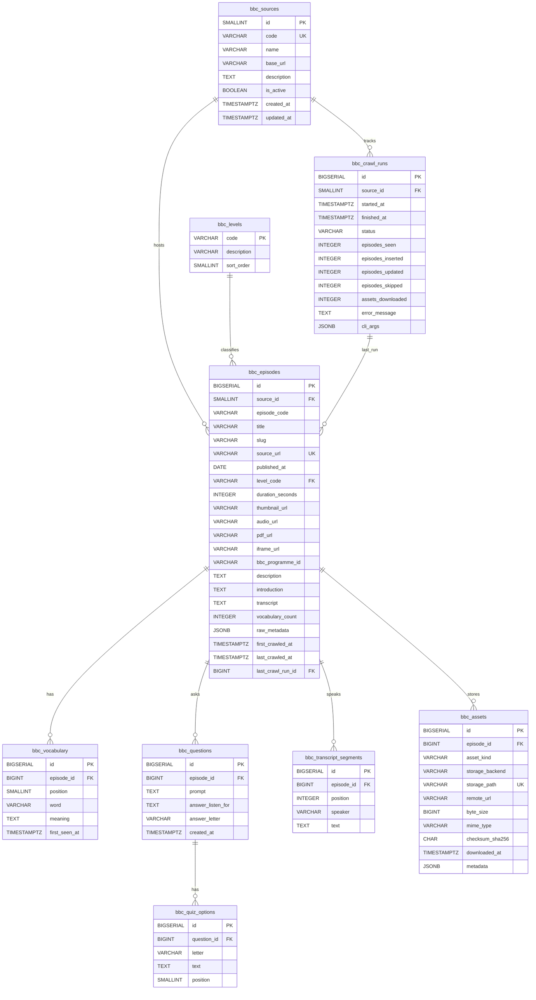

# BBC Microservice — ERD

PostgreSQL schema for the BBC Learning English listening pipeline. Drawn
from `crawler/bbc/db/schema.sql` (the authoritative source — keep them
in sync).

## Overview

## Key design decisions

1. **`bbc_sources` is provider-agnostic.**  Future YouTube or
   DailyDictation sources plug in as additional rows, not additional
   tables.  All episode-level tables are scoped by `source_id` so
   natural-key uniqueness is enforced *per provider* (a YouTube video
   and a BBC episode can share a slug without colliding).

2. **Episode natural key = `(source_id, source_url)`.**  This is what
   the crawler uses for upsert.  A separate `(source_id, episode_code)`
   unique key catches data inconsistencies — if BBC ever changes the
   URL pattern for an old episode, the code stays stable.

3. **Child collections are `replace_*` not `upsert`.**  Vocabulary,
   questions, and transcript segments are deleted-then-reinserted per
   episode.  The data is small (≤ 20 rows per episode) and BBC
   occasionally re-shuffles positions or drops words, so a clean
   replace is more correct than a diff.

4. **Assets use content-addressable storage where possible.**  The
   `(episode_id, asset_kind, storage_path)` unique constraint is the
   dedup key.  Add `checksum_sha256` later to detect BBC changing the
   underlying MP3 without renaming the file.

5. **`bbc_crawl_runs` is operational telemetry.**  It lets the
   `--stats` CLI answer "what was the last crawl, and what did it
   find?" without re-scanning episodes.  One row per CLI invocation;
   episodes link back via `last_crawl_run_id`.

6. **Generated column on `word_count`.**  PostgreSQL computes the
   transcript word count on write/update so we never have to remember
   to refresh it from the application side.

7. **Trigram GIN index on `title` is optional.**  Created only when
   the `pg_trgm` extension is available (it ships with PostgreSQL
   contrib but is not pre-installed on every managed service).
